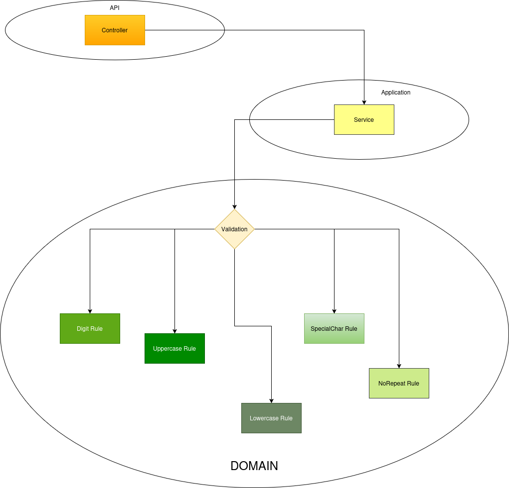
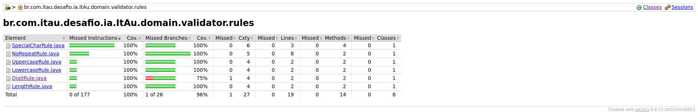

# Validador de Senha com IA

## Descrição

Este projeto implementa uma API REST para validação de senhas, seguindo critérios rigorosos de segurança. Além disso, utilizamos ferramentas de IA produtiva (Copilot) para auxiliar na geração de testes, documentação e refatoração de código, garantindo maior qualidade e eficiência.

## Arquitetura



- Spring Boot como framework principal.

- Arquitetura Limpa: separação clara entre camadas (controllers, services, rules).

- Princípios SOLID aplicados para garantir baixo acoplamento e alta coesão.

- Swagger/OpenAPI para documentação da API.

- Utiliza _Spring Actuator_ para endpoints de monitoramento.

## Começando com o Projeto

| Software | Versão |
| ---------| -------|
| Java     | 21     |
| Maven    | 3.9    |

> O Maven é opcional. Pode-se utilizar o pacote _mvnw_ para executar o pom!

1. Clone o repositório.

```bash
$ git clone https://github.com/benedictotavio/desafio-itau.git
```

2. Execute alguns testes.

```bash
./mvnw test

# ou

mvn test
```

3. Execução para desenvolvimento

```bash
./mvnw spring-boot:run

# ou

mvn spring-boot:run
```
4. Execução para deploy.

```bash
./mvnw clean install && java -jar target/ItAu-0.0.1-SNAPSHOT.jar

# ou

mvn clean install && java -jar target/ItAu-0.0.1-SNAPSHOT.jar
```

# Regras de Validação (RULES)

### A senha é considerada válida se atender a todos os critérios abaixo:

| Regra            | Descrição                                      | Motivo                          |
|------------------|-----------------------------------------------|---------------------------------|
| Tamanho mínimo   | Nove ou mais caracteres                        | Garantir complexidade mínima    |
| Dígito           | Ao menos 1 dígito                             | Evitar senhas apenas alfabéticas|
| Letra minúscula  | Ao menos 1 letra minúscula                     | Diversidade de caracteres       |
| Letra maiúscula  | Ao menos 1 letra maiúscula                     | Diversidade de caracteres       |
| Caractere especial | Ao menos 1 dos caracteres !@#$%^&*()-+       | Aumentar entropia               |
| Sem repetição    | Não possuir caracteres repetidos               | Evitar padrões previsíveis      |
| Sem espaços      | Espaços não são válidos                        | Evitar ambiguidades             |

## Por que usar RULES ao invés de UseCases ou Jakarta Validation?

### 🔹 Extensibilidade
- Novas regras podem ser adicionadas sem modificar o `PasswordService`.
- Basta criar uma nova classe que implemente `ValidationRule` e anotá-la com `@Component`.
- Segue o princípio **Open/Closed (OCP)**: aberto para extensão, fechado para modificação.

### 🔹 Desacoplamento
- O `PasswordService` conhece apenas a interface `ValidationRule`, não os detalhes de cada regra.
- Isso reduz dependências diretas e facilita manutenção.

### 🔹 Testabilidade
- É simples testar o `PasswordService` isoladamente, injetando apenas as regras necessárias.
- Permite uso de **mocks** ou **stubs** sem carregar todo o contexto do Spring.

### 🔹 Reuso
- As regras são independentes e podem ser reutilizadas em outros serviços.
- Exemplo: `LengthRule` pode validar senhas em cadastro, login ou outros domínios.

### 🔹 Clareza e Organização
- Cada regra tem responsabilidade única (**Single Responsibility Principle - SRP**).
- O código fica mais legível e evita métodos com múltiplas condições complexas.

### 🔹 Flexibilidade
- É possível configurar quais regras devem ser aplicadas apenas ajustando os beans disponíveis.
- Permite cenários diferentes (ex.: regras mais rígidas em produção, regras mais simples em testes).

---

### ✅ Conclusão
Essa arquitetura promove:
- **Manutenibilidade**
- **Escalabilidade**
- **Qualidade de código**

Além disso, está alinhada com boas práticas como **SOLID** e **Inversão de Controle (IoC)**.


### Swagger

A documentação interativa está disponível em:

```bash
http://localhost:8080/api/v1/swagger-ui.html
```

## API

### URL

```bash
 http://localhost:8080/api/v1/
```

### POST /password/validate

#### Dados recebidos

| Campo    | Tipo   | Descrição                                |
|----------|--------|------------------------------------------|
| password | string | Senha a ser validada para validação no sistema |

#### Exemplo de requisição (cURL - Shell)

```bash
curl -X POST http://localhost:8080/api/v1/password/validate 
-H "Content-Type: application/json" 
-d '{"password":"SuaSenha123!"}'
```

#### Exemplo de resposta (JSON)

```json
{
  "valid": true
}
```

### Actuator

Endpoints de monitoramento disponíveis em:
```bash
http://localhost:8080/actuator
```

Exemplos: /health, /metrics, /info.

## Testes e Cobertura

*Cobertura de testes:* 90% (Jacoco).

*Relatório Jacoco:* disponível em target/site/jacoco/index.html.

*Imagem de cobertura:*



## Uso da IA

*Ferramenta utilizada*: Copilot.

*Finalidade:* geração de testes unitários e de integração, documentação (README), refatoração de código.

*Exemplos de prompts:* criação de testes para controllers, explicação das regras de validação, geração de README.

*Benefícios:* aumento da produtividade, documentação mais clara, testes mais completos.

#### Este projeto demonstra aplicação prática de Clean Code, SOLID e uso de IA produtiva para aumentar qualidade e eficiência no desenvolvimento.

##### Exemplos de Prompts Utilizados

1. Criação de Testes

*Pergunta:* "Como posso criar testes unitários para o controller de validação de senha usando Spring Boot e JUnit?"

> Resposta: "Você pode utilizar o Spring Boot Test com JUnit para criar testes unitários focados no controller. Configure mocks para os serviços e valide as respostas HTTP, garantindo que as regras de validação sejam corretamente aplicadas."

2. Estruturação de Pastas

*Pergunta:* "Qual é a estrutura recomendada de pastas para organizar uma aplicação Spring Boot com arquitetura limpa?"

> Resposta: "Uma estrutura comum inclui pastas separadas para controllers, services, rules, config e testes. Por exemplo:

```markdown
src/
 └── main/
     ├── java/
     │    └── com/
     │         └── otavio/
     │              └── passwordvalidator/
     │                   ├── api/
     │                   │    └── controller/
     │                   │         └── PasswordController.java
     │                   │
     │                   ├── application/
     │                   │    └── service/
     │                   │         └── PasswordService.java
     │                   │
     │                   ├── domain/
     │                   │    ├── validator/
     │                   │    │     ├── PasswordValidator.java
     │                   │    │     ├── rules/
     │                   │    │     │     ├── DigitRule.java
     │                   │    │     │     ├── UppercaseRule.java
     │                   │    │     │     ├── LowercaseRule.java
     │                   │    │     │     ├── SpecialCharRule.java
     │                   │    │     │     └── NoRepeatRule.java
     │                   │    │     └── ValidationRule.java (interface)
     │                   │
     │                   ├── infrastructure/
     │                   │    ├── config/
     │                   │    │     └── SwaggerConfig.java
     │                   │    ├── logging/
     │                   │    └── actuator/
     │                   │
     │                   └── PasswordValidatorApplication.java
     │
     └── resources/
          ├── application.yml
          └── logback-spring.xml
          
 └── test/
     ├── java/
     │    └── com/
     │         └── otavio/
     │              └── passwordvalidator/
     │                   ├── api/
     │                   │    └── PasswordControllerTest.java
     │                   ├── application/
     │                   │    └── PasswordServiceTest.java
     │                   └── domain/
     │                        └── validator/
     │                             ├── DigitRuleTest.java
     │                             ├── UppercaseRuleTest.java
     │                             ├── LowercaseRuleTest.java
     │                             ├── SpecialCharRuleTest.java
     │                             └── NoRepeatRuleTest.java
     │
     └── resources/
          └── application-test.yml
```